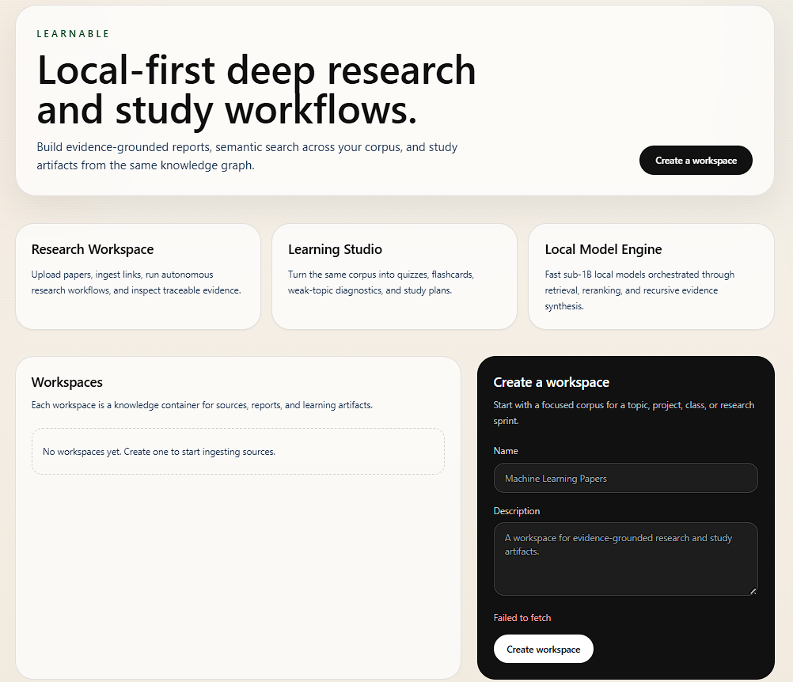
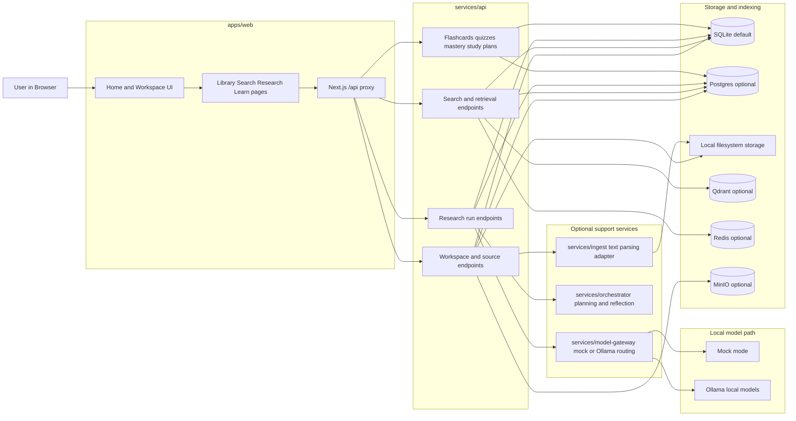
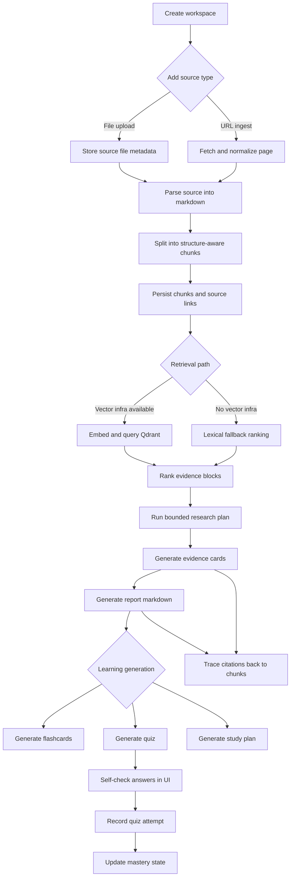
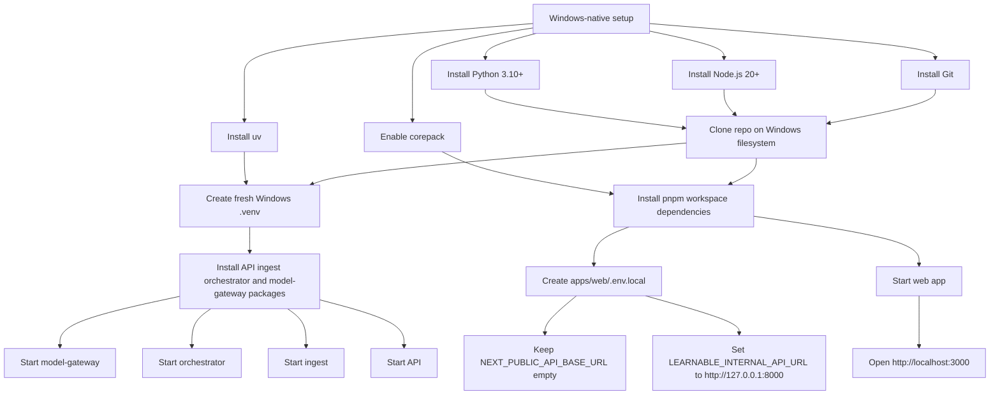

# Learnable

Learnable is a local-first AI research and learning system for evidence-grounded knowledge work.

It combines two product surfaces on top of one shared knowledge engine:

- `Research Workspace`: ingest sources, search them, run bounded deep-research jobs, and generate traceable reports.
- `Learning Studio`: turn the same grounded evidence into flashcards, quizzes, study plans, and mastery tracking.



> Homepage screenshot lives in [`docs/assets/readme/homepage-placeholder.png`](docs/assets/readme/homepage-placeholder.png). The architecture, workflow, and Windows setup diagrams are kept as Mermaid sources in [`docs/assets/readme/`](docs/assets/readme/).

## Why this repo exists

The original repository was discarded and rebuilt as a clean greenfield prototype. The current codebase is designed around a production-grade shape even though the current implementation still uses lightweight fallbacks in a few places to keep local setup fast.

The key product goals are:

- local-first operation
- evidence-grounded outputs
- reusable research artifacts
- learning workflows derived from the same source corpus
- fast iteration on modest hardware

## What Learnable does today

### Research workflow

- Create and manage workspaces
- Upload `.txt` and `.md` files
- Ingest URLs with HTML extraction
- Parse documents into structure-aware chunks
- Search a workspace corpus
- Run bounded research jobs
- Generate:
  - report markdown
  - evidence cards
  - plan metadata
  - retrieval trace

### Learning workflow

- Generate flashcard decks from the latest grounded research run
- Generate quizzes from grounded evidence
- Record quiz attempts from the UI
- Update and display mastery state
- Generate study plans from the latest report

### Runtime behavior

- API works with local SQLite by default
- Search falls back to lexical ranking if Qdrant is unavailable
- Research synthesis falls back to heuristic generation if model services are unavailable
- Model gateway supports `mock` mode for deterministic local development and `ollama` mode for real local inference
- Rich document parsing via Docling is optional

## Product architecture



### High-level system

| Component | Role | Default Port | Required for minimal local run |
| --- | --- | --- | --- |
| `apps/web` | Next.js product UI | `3000` | Yes |
| `services/api` | FastAPI product control plane | `8000` | Yes |
| `services/ingest` | Parsing adapter service | `8100` | Optional |
| `services/orchestrator` | Planning and reflection service | `8200` | Optional |
| `services/model-gateway` | Local model routing and caching boundary | `8300` | Optional |
| `Postgres` | Persistent relational storage | `5432` | Optional in prototype |
| `Redis` | Hot cache and dedupe store | `6379` | Optional in prototype |
| `Qdrant` | Dense retrieval | `6333` | Optional in prototype |
| `MinIO` | Object storage | `9000` | Optional in prototype |
| `Ollama` | Local model serving | `11434` | Optional in prototype |

### Repo layout

```text
learnable/
  apps/
    web/
  services/
    api/
    ingest/
    orchestrator/
    model-gateway/
  packages/
    contracts/
    config/
    ui/
  infra/
    compose/
  docs/
    architecture/
    assets/readme/
    product/
    runbooks/
```

### Service responsibilities

#### `apps/web`

- Workspace creation and navigation
- Source library
- Search UI
- Research run UI
- Learning artifact UI
- Quiz self-check and mastery update

#### `services/api`

- Product-facing HTTP API
- Workspace, source, document, report, and learning endpoints
- Local storage and database writes
- Search fallback logic
- Research run execution fallback logic

#### `services/ingest`

- Text parsing adapter
- Future home for richer document normalization and parser orchestration

#### `services/orchestrator`

- Research plan generation
- Reflection and coverage checks
- Future home for recursive research graph execution

#### `services/model-gateway`

- One boundary for local model calls
- Role-based routing
- Mock mode for deterministic development
- Ollama mode for real local inference
- Future home for structured output enforcement and model caching policy

## Workflow



### End-to-end data flow

1. User creates a workspace.
2. User uploads files or adds URLs.
3. The API stores the source and parses it into normalized markdown.
4. The parser produces structure-aware chunks.
5. Chunks are stored in the database and optionally indexed in Qdrant.
6. Search retrieves chunk-level evidence from vector search or lexical fallback.
7. Research runs build a bounded plan, retrieve evidence, synthesize a report, and store evidence cards.
8. Learning generation converts the latest grounded research run into flashcards, quizzes, and study plans.
9. Quiz attempts update mastery state for each concept.

### Design constraints in the current prototype

- The repo is shaped for deeper research orchestration, but the current execution path is intentionally simple and locally runnable.
- The API falls back when support services are down instead of failing hard.
- The model cap for the prototype is `<=1B` so local inference stays practical on modest hardware.

## Local model strategy

The prototype architecture is designed around small specialized models instead of one large general model.

| Role | Preferred model | Purpose |
| --- | --- | --- |
| Planner / router | `qwen3:0.6b` | decomposition, routing, control-plane prompts |
| Synthesizer | `gemma3:1b` | concise research synthesis |
| Synthesizer fallback | `llama3.2:1b` | compatibility fallback |
| Embeddings | `qwen3-embedding:0.6b` | dense retrieval |
| Reranker | `bge-reranker-v2-m3` | relevance reordering |

### Current operating modes

- `mock`
  - default
  - deterministic local fallback
  - best for quick setup and UI/API development
- `ollama`
  - routes generation and embedding requests to a local Ollama instance
  - best for validating the local-model path

## Quick start on a laptop



### Prerequisites

- Python `3.10+`
- Node.js `20+`
- `corepack`
- `uv`
- Optional: Docker
- Optional: Ollama

### Fastest path: minimal local run

This path uses:

- SQLite
- local filesystem storage
- mock model gateway
- no Docker
- no Postgres, Redis, Qdrant, or MinIO

#### 1. Clone and enter the repo

```bash
git clone https://github.com/sortira/learnable.git
cd learnable
```

#### 2. Create a Python environment and install backend services

```bash
uv venv .venv
source .venv/bin/activate
uv pip install -e services/api[dev] -e services/ingest -e services/orchestrator -e services/model-gateway
```

#### 3. Install the web app dependencies

```bash
corepack enable
corepack pnpm install
```

#### 4. Copy the example environment

```bash
cp .env.example .env
```

Keep `NEXT_PUBLIC_API_BASE_URL` empty unless you have a specific reason to call the API directly from the browser. The default setup uses a same-origin Next.js proxy, which avoids the `Failed to fetch` issue that can happen when `localhost:8000` is not exposed cleanly to the browser.

#### 5. Start the services

Open five terminals.

```bash
source .venv/bin/activate
cd services/model-gateway
python -m uvicorn app.main:app --host 127.0.0.1 --port 8300
```

```bash
source .venv/bin/activate
cd services/orchestrator
python -m uvicorn app.main:app --host 127.0.0.1 --port 8200
```

```bash
source .venv/bin/activate
cd services/ingest
python -m uvicorn app.main:app --host 127.0.0.1 --port 8100
```

```bash
source .venv/bin/activate
cd services/api
python -m uvicorn app.main:app --host 127.0.0.1 --port 8000
```

```bash
cd apps/web
corepack pnpm dev --port 3000
```

Then open `http://localhost:3000`.

### Simplest possible development path

If you only want to inspect the main UI and API loop, you can start just:

```bash
source .venv/bin/activate
cd services/api
python -m uvicorn app.main:app --host 127.0.0.1 --port 8000
```

```bash
cd apps/web
corepack pnpm dev --port 3000
```

The optional services improve planning, parsing, and local-model behavior, but the API has fallbacks so the app still works.

### Optional: richer parser and storage integrations

Install the heavier extras when you need them:

```bash
source .venv/bin/activate
uv pip install -e services/api[parsers,storage]
```

This enables:

- Docling-powered parsing for richer document formats
- Qdrant client integration
- MinIO client integration

### Optional: local model inference with Ollama

Install the local models you want, then switch the gateway mode:

```bash
export LEARNABLE_MODEL_GATEWAY_MODE=ollama
ollama pull qwen3:0.6b
ollama pull gemma3:1b
ollama pull llama3.2:1b
ollama pull qwen3-embedding:0.6b
```

The app still talks only to `services/model-gateway`; you do not need to change the frontend or API code paths.

### Windows handoff

Nothing model-related has been downloaded yet. When you switch to Windows, treat this repo as source code only and rebuild the runtime dependencies natively on Windows.

Delete or ignore these WSL-generated artifacts before your Windows run:

- `.venv`
- `node_modules`
- `apps/web/.next`
- `test_learnable.db`
- any temporary files under `/tmp` from this WSL session

Recommended Windows-first sequence:

1. Clone or reopen the repo from Windows.
2. Create a fresh Windows virtualenv.
3. Reinstall Python dependencies.
4. Reinstall workspace Node dependencies.
5. Keep `NEXT_PUBLIC_API_BASE_URL` empty.
6. Set `LEARNABLE_INTERNAL_API_URL=http://127.0.0.1:8000` in `apps/web/.env.local`.
7. Start the services from Windows terminals.

Future local model setup on Windows:

1. Install Ollama for Windows.
2. Set `LEARNABLE_MODEL_GATEWAY_MODE=ollama`.
3. Pull:
   - `qwen3:0.6b`
   - `gemma3:1b`
   - `llama3.2:1b`
   - `qwen3-embedding:0.6b`

### Optional: infrastructure stack

If you want the full local stack, start the infrastructure services:

```bash
make infra
```

This brings up:

- Postgres
- Redis
- Qdrant
- MinIO

## Environment configuration

Use `.env.example` as the base file.

Important variables:

- `NEXT_PUBLIC_API_BASE_URL`
- `LEARNABLE_DATABASE_URL`
- `LEARNABLE_MODEL_GATEWAY_MODE`
- `LEARNABLE_INGEST_URL`
- `LEARNABLE_ORCHESTRATOR_URL`
- `LEARNABLE_MODEL_GATEWAY_URL`
- `LEARNABLE_QDRANT_URL`
- `LEARNABLE_STORAGE_ROOT`

Defaults are set so the prototype can run locally with minimal changes.

## Manual QA checklist

Use this checklist after the stack is running:

1. Open `http://localhost:3000`.
2. Create a workspace from the homepage.
3. Confirm you are redirected into the new workspace.
4. Upload a `.txt` or `.md` source in `Library`.
5. Add a URL source in `Library`.
6. Confirm both sources appear in the source list.
7. Confirm parsed documents appear in the document list.
8. Search for a phrase from your uploaded source in `Search`.
9. Confirm chunk-level results appear with citations.
10. Run a research job in `Research`.
11. Confirm a report and evidence cards are generated.
12. Generate flashcards in `Learn`.
13. Generate a quiz in `Learn`.
14. Mark each quiz question as right or missed.
15. Record the quiz attempt.
16. Confirm mastery entries appear.
17. Generate a study plan.

## Current limitations

- Best-tested upload path is currently `.txt` and `.md`
- Richer binary document parsing is optional, not default
- Search is lexical when vector infrastructure is unavailable
- Research execution is bounded and intentionally conservative
- The architecture is ahead of the implementation in a few areas:
  - recursive research graphs
  - deep caching layers across all services
  - full vector-first retrieval in the default path
  - richer evaluation harnesses

## Validation status

This repo has already been validated with:

- API tests
- frontend typecheck
- Python syntax checks across services

The main manual workflow should be tested by running the local stack and following the checklist above.

## Docs

- Architecture overview: [`docs/architecture/overview.md`](docs/architecture/overview.md)
- Product vision: [`docs/product/vision.md`](docs/product/vision.md)
- Local development runbook: [`docs/runbooks/local-development.md`](docs/runbooks/local-development.md)

## README image assets

Add or replace screenshots and diagrams here:

- [`docs/assets/readme/`](docs/assets/readme/)

Recommended assets in this folder:

1. homepage screenshot
2. architecture Mermaid source: `architecture.mmd`
3. workflow Mermaid source: `workflow.mmd`
4. Windows setup Mermaid source: `windows-setup.mmd`
